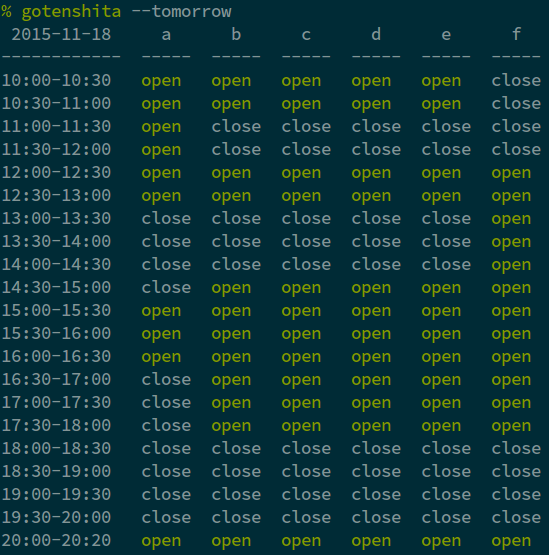

# gotenshita

[](https://badge.fury.io/py/gotenshita)
[](https://travis-ci.org/wkentaro/gotenshita)

See Gotenshita court open status. The information is got from
[undoukai](http://www.undou-kai.com/senyu/senyu_yoyaku.html).


## Install

```bash
pip install gotenshita
```


## Usage

```bash
% gotenshita -h
usage: gotenshita [-h] [-p] [-t] [court]

positional arguments:
  court            A to F (default is all), supports multiple select like
                    'a,f'

optional arguments:
  -h, --help       show this help message and exit
  -p, --show-past  show even if past time
  -t, --tomorrow   show tomorrow's data
```




## License

See [LICENSE](LICENSE).
